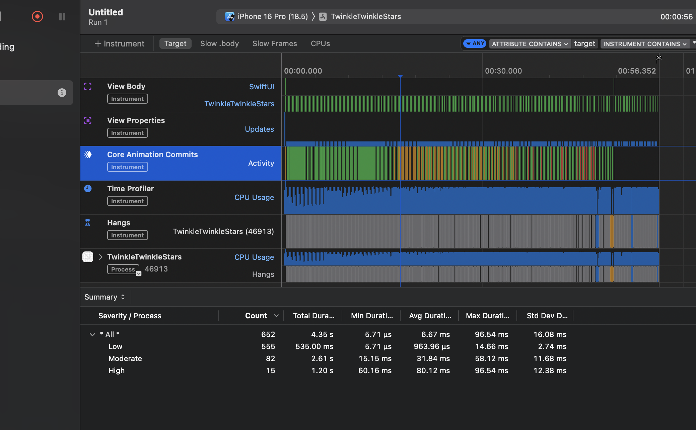
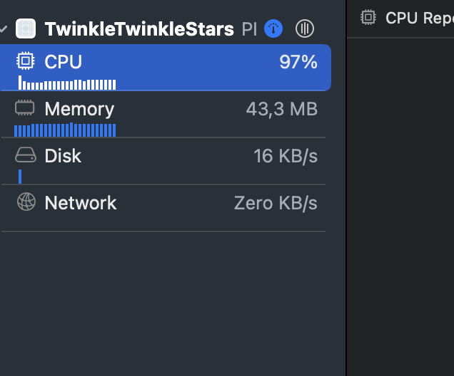
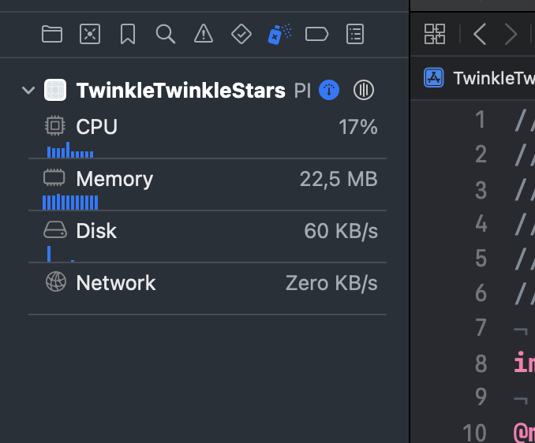
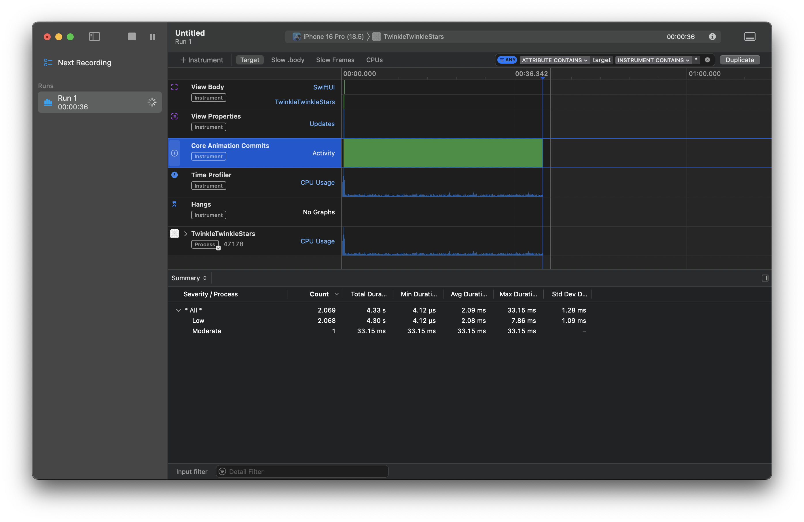

# TimelineView Example [DRAFT]

This litle experiment was born from the idea "how to make animated backgrounds with SwiftUI". Sure, one could use metal and shaders to apply the desired effect, but I was looking for a away to do this without using shaders.

## A lot of Stars

My idea then was to create a background of flickering stars. A simple loop through some rects, drawing the circles and that`s it!

I could do it using the Circle or Rectangle components, but to fill the iPhone screen I would need at least 200 components on the screen. When We imagine an app with a background that has 200 views with an infinite scroll view... Things start to get slow for the SwiftUI render.



As one can see there is a lot going on with the core animation and view rendering.



And it`s no surprise to see cpu usage and memory going high with this approach.


```Swift

GeometryReader { proxy in
    ZStack {
        ForEach(0..<200) { i in
            Circle()
                .fill(Color.white)
                .frame(width: viewModel.stars[i].width, height: viewModel.stars[i].height)
                .position(x: viewModel.stars[i].x, y: viewModel.stars[i].y)
                .opacity(opacity[i])
                .onReceive(timer, perform: { ti in
                    
                    withAnimation(Animation.spring(duration: Double.random(in: 0.5...1.1))) {
                        opacity[i] = 0.1 + sin(ti.timeIntervalSince1970 * viewModel.stars[i].freq) * viewModel.stars[i].initialOpacity
                        
                    }
                    
                    
                })
        }
    }
}

```

If we check the code it`s easy do spot some problems. First, we are drawing a lot of views and them animating each one of them. If this were a true app with an scroll view view and content being displayed we would be seing a very slow app.

## Canvas and TimelineView

Another approach to reach the desired effect is to use Canvas. SwiftUI blank screen, where we can draw anything. But only the canvas is not enough. To animate things we need a very important component: time.

Nothing moves without time being around to calculate some displacement. To insert time into the equation there is the TimelineView. Which is a component that can be used to animate any SwiftUI component. What it does is to create a update loop, where it will call method inside a custom component to update things on the screen.

```Swift

TimelineView(.animation) { timeline in
    Canvas { context, size in
        
        for star in stars {
            
            let rect = CGRect(
                x: star.x,
                y: star.y,
                width: star.width,
                height: star.height
            )
            
            star.twinkle(time: timeline.date)
            
            let starPath = Path(ellipseIn: rect)
            context.fill(starPath ,with: .color(.white.opacity(star.opacity)))
                
            
        }
        
    }
}

```

As we can see the constructor of TimelineView takes just a TimelineSchedule type. Which can be:
- animation: let the system choose the update interval or pass a mininumInterval;
- periodic: define a regular time interval to update;
- everyMinute

With .animation we let the system choose the appropriate time to update the component inside timeline and we provide a update method inside our star object.

```Swift

func twinkle(time: Date) {
    if Star.lastDate == nil {
        Star.lastDate = time
    }
    
    let delta =  Star.lastDate!.distance(to: Date())
    
    if shouldTwinkle {
        self.opacity =  sin(delta * freq) * initialOpacity
    }
    
}

```

With the twinkle method the star can animate using a oscilator function like sin to go from 0 to 1 opacity and back, thus achieving our desired effect. 

With less cpu:



And less animation and drwaing overhead:

